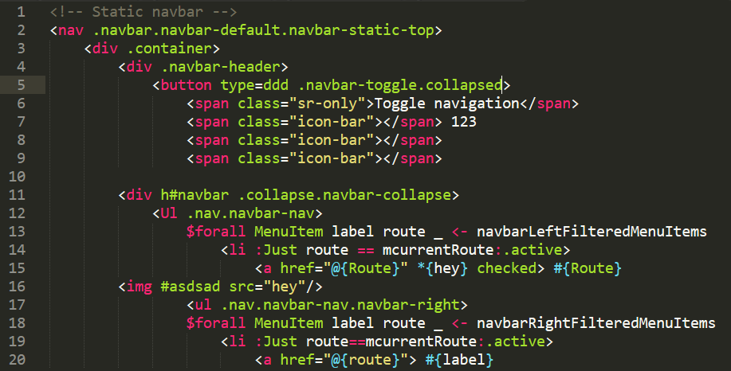

# Sublime-syntax-shakespeare
Quick sublime text syntax for the shakespearean templates.

## How to use
Just drop the files in a `Shakespeare` directory in your `Packages/User` folder (`Preferences > Browse Packages...` - then go to the `User` subdirectory)

## Features
 - Hamlet support

## Todo
- [ ] Lucius support
- [ ] Julius support
 
## Screenshot

